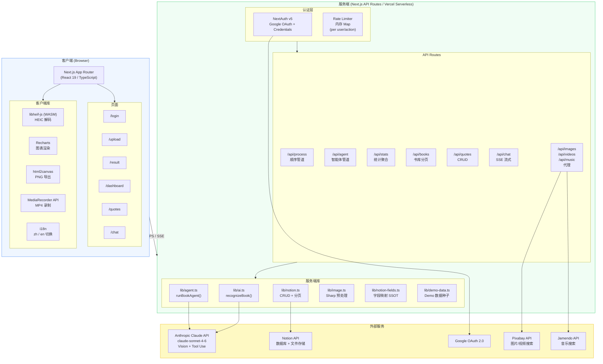
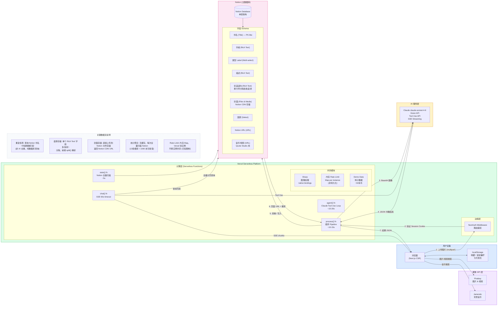
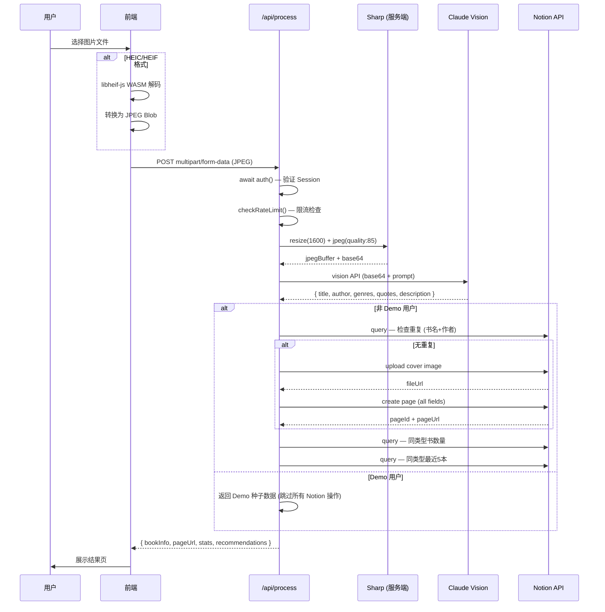

# Lovely Shelf — 系统图表

---

## 1. 核心业务流程图（用户视角）

```mermaid
flowchart TD
    A([用户访问]) --> B{已登录?}
    B -- 否 --> C[登录页]
    C --> D[Google OAuth]
    C --> E[Demo 一键体验]
    D --> F{邮箱白名单?}
    F -- 否 --> G[拒绝访问]
    F -- 是 --> H([主界面])
    E --> H

    H --> UP[📷 上传页]
    H --> QU[💬 语录页]
    H --> DB[📊 Dashboard]
    H --> CH[🤖 Chat]

    %% Upload Flow
    UP --> UP1[选择/拖拽图片]
    UP1 --> UP2{HEIC格式?}
    UP2 -- 是 --> UP3[前端转换 HEIC→JPEG\nlibheif-js / heic2any / Canvas]
    UP2 -- 否 --> UP4[Sharp 压缩\n1600px / quality 85]
    UP3 --> UP4
    UP4 --> UP5{Demo 用户?}
    UP5 -- 是 --> UP6[Claude Vision 识别书籍]
    UP5 -- 否 --> UP6
    UP6 --> UP7{有重复书籍?}
    UP7 -- 是 --> UP8[返回已有记录]
    UP7 -- 否 --> UP9[上传封面到 Notion]
    UP9 --> UP10[写入 Notion 数据库]
    UP10 --> UP11[查询同类推荐书]
    UP11 --> UP12[展示结果页\n书信 + 推荐 + 成就徽章]
    UP8 --> UP12

    %% Quotes Flow
    QU --> QU1[浏览语录\nAll / 手写 / 书库 / 收藏]
    QU1 --> QU2[Quote Studio 编辑器]
    QU2 --> QU3[自定义背景/字体/音乐/视频]
    QU3 --> QU4{导出格式}
    QU4 -- PNG --> QU5[html2canvas 截图]
    QU4 -- MP4 --> QU6[MediaRecorder 录制]

    %% Dashboard Flow
    DB --> DB1[/api/stats 聚合数据]
    DB1 --> DB2[类型饼图]
    DB1 --> DB3[每月条形图]
    DB1 --> DB4[30天热力图]
    DB1 --> DB5[最近书籍网格]
    DB5 --> DB6[BookDetailModal\n查看/编辑/保存]

    %% Chat Flow
    CH --> CH1[发送消息/上传图片]
    CH1 --> CH2[SSE 流式返回]
    CH2 --> CH3{Claude Tool Use}
    CH3 -- recognize_book --> CH4[识别书籍]
    CH3 -- query_books --> CH5[查询书库]
    CH3 -- list_genres --> CH6[列出类型]

    style A fill:#4f46e5,color:#fff
    style H fill:#059669,color:#fff
    style UP12 fill:#0891b2,color:#fff
```

---

## 2. 技术架构图（系统视角）



---

## 3. System Design 图（含数据库 & 数据流）



---

## 图例补充：Upload Pipeline 对比


