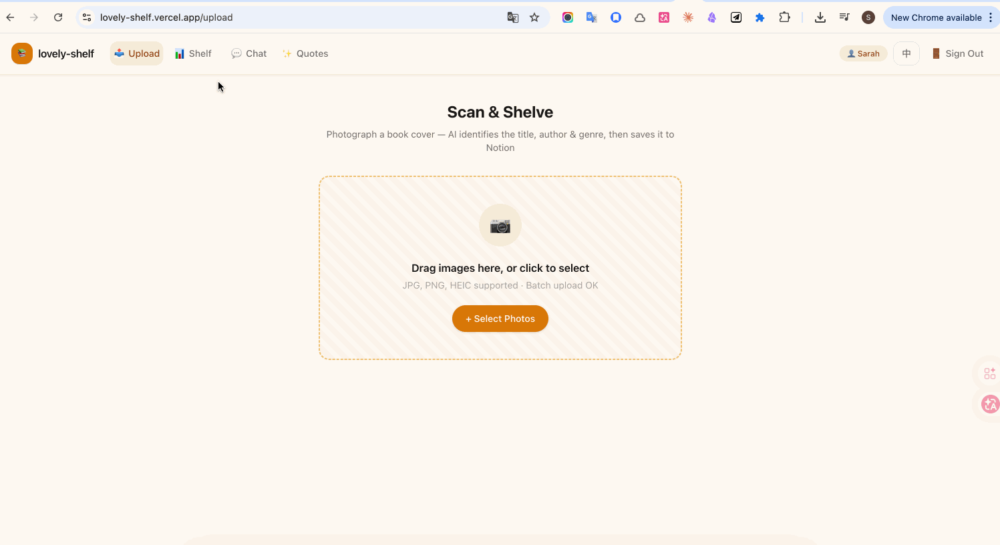
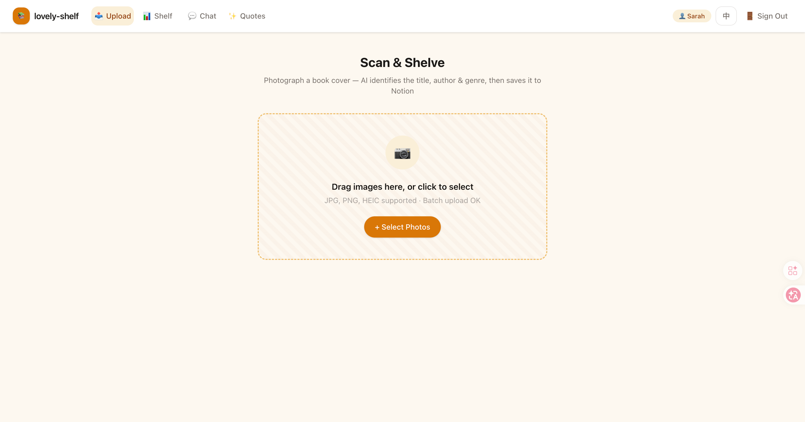
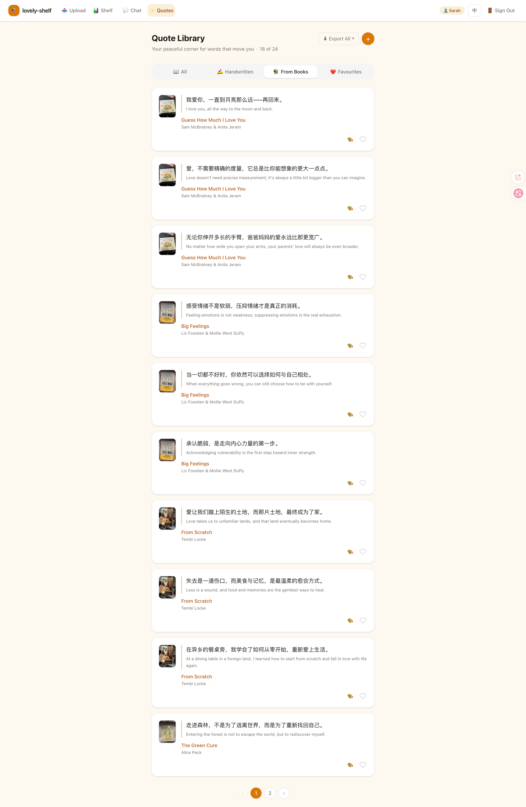
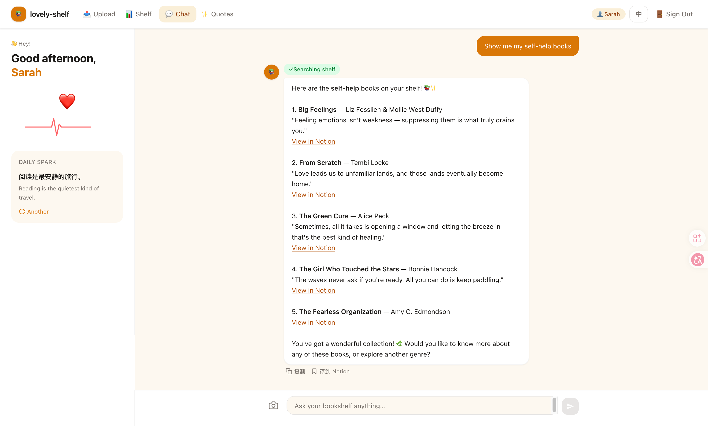

# I Vibe-Coded a Full-Stack AI App in 7 Days as a Beginner

> Point your camera at a book cover. Watch it land in Notion.

That's the whole pitch for lovely-shelf. Upload a photo of any book cover, and Claude AI reads it — extracts the title, author, genre, country of origin, and memorable quotes — then writes everything into your Notion database automatically. No typing. No copy-paste. Just a photo.

I want to cover two things: what I built, and how I built it. The how is the interesting part. I'm a beginner developer learning Next.js. I vibe-coded this entire thing with Claude Code as my pair programmer, using a structured methodology called Superpowers that changed how I think about building software. Seven days. One real app.

---

## What Is lovely-shelf?

**[Try the live demo](https://lovely-shelf.vercel.app)** — click the demo button, no account needed.



lovely-shelf turns book cover photos into a fully-tagged Notion library. It has five sections:

- **Upload**: drag a book cover photo, Claude reads it in seconds
- **Dashboard**: genre pie chart, 30-day activity heatmap, full book grid
- **Quotes**: every quote Claude extracted, searchable and filterable
- **Quote Studio**: turn any quote into a shareable card (PNG export or MP4 with background music)
- **Chat**: a streaming AI assistant that knows your entire shelf

The full data pipeline:

```
Photo → Preprocess (sharp) → Claude Vision → Notion write
         resize ≤1200px         returns JSON       dedup + create
         convert to JPEG        title, author,     cover upload
                                genres, quotes     achievement badge
```

---

## The Problem I Was Solving

I already kept a Notion database of books I'd read. The problem was maintenance. Every time I finished a book, I'd open Notion, create a new row, type the title, type the author, search for a cover image, copy a quote or two — five minutes minimum per book.

The specific frustrations:

- Typing titles by hand means typos that break filtering later
- Finding cover images meant opening another browser tab
- Quotes only got saved if I remembered them at entry time, not when I read them
- The friction meant I'd skip entries entirely

I wanted to close the loop at the moment of reading. Point the camera, done. lovely-shelf is exactly that.

---

## Tech Stack

| Layer | Technology |
|-------|------------|
| Framework | Next.js (App Router) + TypeScript |
| Styling | Tailwind CSS v4 |
| Charts | Recharts |
| Image processing | sharp (server-side resize + JPEG) |
| HEIC support | libheif-js → heic2any → Canvas API |
| AI | Anthropic Claude SDK |
| Database | Notion (@notionhq/client) |
| Auth | next-auth v5 + Google OAuth |
| Real-time | Server-Sent Events (SSE) for chat |
| Image search | Pixabay API |
| Music | Jamendo API |
| Card rendering | Satori (JSX → SVG → PNG) |
| Deployment | Vercel |

---

## APIs Used

### Anthropic Claude API

The core of the whole thing. Claude does three different jobs:

- **Vision recognition** — receives a base64 JPEG, returns structured book metadata as JSON
- **Tool use agent** — orchestrates the pipeline by calling four custom tools in sequence; it decides the order and handles edge cases like duplicates
- **Streaming chat** — answers questions about your shelf via SSE with access to the same tool set

Model: `claude-sonnet-4-6`. The 200k context window matters for chat — a large shelf means a lot of book data to pass as context.

The key technique: constraining Claude to a **fixed genre vocabulary**. Without it, one book gets tagged "Psychology", another "心理学", a third "self-help" — and your Notion filters never catch them all. Fixed vocabulary means consistent filtering across the whole library.

### Notion API

Full read/write access. The app creates pages, uploads cover images to Notion's file storage, queries for duplicates by title + author, and reads back the full library for Dashboard and Chat.

One thing to know: a full write (image upload + page create) takes 3–5 seconds. That's Notion's infrastructure, not a bug. You plan around it with loading states.

### Pixabay + Jamendo APIs

Pixabay provides background images and videos for the Quote Studio. Jamendo provides royalty-free music for MP4 recordings. Both are proxied through `/api/images` and `/api/music` routes to keep keys server-side.

---

## AI Skills & Techniques

### 1. Structured JSON from Vision

The prompt tells Claude exactly what fields to return and gives it a fixed genre list to choose from:

```typescript
text: `Look at this book cover and return ONLY a JSON object:
{
  "title": "string",
  "author": "string",
  "genres": ["pick ONLY from: 小说 散文 历史 哲学 心理相关 励志 政治 经济 科技 艺术 儿童读物 其他"],
  "description": "2-3 sentence summary",
  "quotes": ["2-3 memorable quotes"]
}
Return only the JSON. No explanation, no markdown.`
```

### 2. Error-Resilient JSON Parsing

Even with tight prompting, Claude occasionally wraps output in a sentence. Three-tier parsing handles it:

```typescript
// 1st try: direct parse
// 2nd try: regex extract { ... }
// 3rd try: strip markdown code fences
const match = text.match(/\{[\s\S]*\}/)
```

This pattern works across any AI API — treat model output like user input, not a database response.

### 3. Tool Use Agent Loop

Instead of a fixed pipeline, Claude decides what to call and when:

```typescript
while (true) {
  const response = await anthropic.messages.create({ model, tools, messages })
  if (response.stop_reason === "end_turn") return extractFinalResult(response)

  // Execute whatever tools Claude requested, feed results back
  const toolResults = await executeTools(response.content)
  messages.push({ role: "assistant", content: response.content })
  messages.push({ role: "user", content: toolResults })
}
```

If the duplicate check returns a match, Claude stops and returns the existing record. The model makes sequencing decisions — it's not executing a fixed script.

### 4. Streaming Chat via SSE

Server-Sent Events is the right tool here — simpler than WebSockets for one-directional streaming:

```typescript
for await (const chunk of anthropicStream) {
  if (chunk.type === "content_block_delta") {
    controller.enqueue(encoder.encode(`data: ${JSON.stringify({ text: chunk.delta.text })}\n\n`))
  }
}
```

The system prompt injects the user's library as context. No vector database, no embeddings — just JSON. It works because a personal book library fits in Claude's 200k context window.

### 5. HEIC Preprocessing

iPhone photos are large and in HEIC format. Sharp resizes before sending to Claude (cuts API costs, stays under size limits). HEIC conversion uses a three-tier fallback because no single library handles every device:

```
libheif-js (WebAssembly) → heic2any → Canvas API
```

---

## The Vibe Coding Process

I built this with Claude Code and a methodology plugin called **Superpowers**. Here's what the workflow looks like in practice.

**The skills:**
- `superpowers:brainstorming` — before any code, explore the feature: user goals, edge cases, simplest version that works
- `superpowers:writing-plans` — convert the design into file paths, function signatures, architectural decisions
- `superpowers:subagent-driven-development` — each task runs as a fresh agent; spec compliance reviewer + code quality reviewer run after each task
- `superpowers:systematic-debugging` — root-cause analysis before any fix; no symptom patching
- `superpowers:verification-before-completion` — actual commands must run and pass before "done"
- `superpowers:frontend-design` — generates HTML mockups for browser preview before any React code

### Example: Building the Quote Studio

**Brainstorm** surfaced questions I hadn't thought of: What's the output format? Should video backgrounds work? How do we handle non-system fonts? What's the fallback if Pixabay is down?

**Writing Plans** produced a concrete plan:
```
src/components/QuoteCard.tsx       — Satori renderer (server-side PNG)
src/app/api/generate-card/route.ts — POST endpoint
src/app/api/images/route.ts        — Pixabay proxy
src/app/api/music/route.ts         — Jamendo proxy
```

**Subagent development** caught one deviation early: the first implementation was doing PNG conversion client-side. The spec said server-side. Caught before it merged.

**Code quality review** found a duplicated font-loading block in two files. Extracted into `src/lib/fonts.ts`.

Total time for the feature: ~4 hours. Half of that was planning. The coding was fast because the decisions were already made.

---

## App Pages

### 📤 Upload



Drag-and-drop or tap to select. Handles multiple files at once with per-file progress. HEIC images convert in-browser before upload. After recognition, a confirmation screen shows what Claude found — review before it writes to Notion. The result shows an achievement badge ("Your 14th 小说!") and a horizontal scroll of similar books from your library.

---

### 📊 Dashboard


Library stats at a glance. Genre breakdown as a pie chart (Recharts), 30-day activity heatmap, total count and year-to-date. Every book appears as a thumbnail grid — tap any to open a full detail modal that fetches live from Notion and lets you edit fields directly.

---

### 💬 Quote Library



Every sentence Claude extracted from every book across your library. Four tabs: all, handwritten, from books, liked. Paginated 10 per page. Likes persist in localStorage. Add your own quotes manually under the handwritten tab.

---

### 🤖 AI Chat



A streaming assistant that knows your library. Ask it to recommend books by genre, surface quotes on a topic, or discuss any book on your shelf. You can also send it a cover photo mid-conversation and it'll recognize the book. Responds in Chinese or English depending on what you write in.

---

## What I Learned

**1. Agents are just structured loops.** A while loop that calls Claude, executes whatever tools it asked for, feeds results back. The model makes the sequencing decisions. Once I understood the loop, the agent code was actually simpler than the sequential version.

**2. Demo mode is an architecture decision, not an afterthought.** I added it on day five, which meant touching every API route. If I'd designed for it on day one, a single interface swap would have handled everything. Adding it late meant finding every Notion call and wrapping it in an if-check.

**3. Rate limit before you share.** Shared with three friends for testing. Hit my Anthropic API limit the next morning. A simple in-memory counter takes thirty minutes. Do it before you share the URL.

**4. SSE > WebSockets for streaming.** WebSockets are for bidirectional real-time. SSE is for server-to-client streams. Chat only needs the server to push text. SSE handles this in ~20 lines. No separate server setup.

**5. Planning isn't overhead — it's the work.** I spent ~30% of time in brainstorm + plan before any code. The Quote Studio (planned properly) took 4 hours total. HEIC support (coded without planning) took a full afternoon and three rewrites.

---

## Try It

**Live demo:** [lovely-shelf.vercel.app](https://lovely-shelf.vercel.app)

**GitHub:** [github.com/sarahwangy/lovely-shelf](https://github.com/sarahwangy/lovely-shelf)

The demo button gives you real Claude AI recognition — scan any book cover nearby and it'll identify it. Works on photos of physical books, Kindle cover screenshots, even clear book spines.

If you're a beginner thinking about building with AI APIs: the integration itself isn't the hard part. Auth, error handling, demo mode, rate limiting — those are the same as any other web app. You can have a working prototype in a weekend.

---

*Built in 7 days. Stack: Next.js App Router, TypeScript, Claude Vision + Tool Use + Streaming, Notion API, Vercel.*
