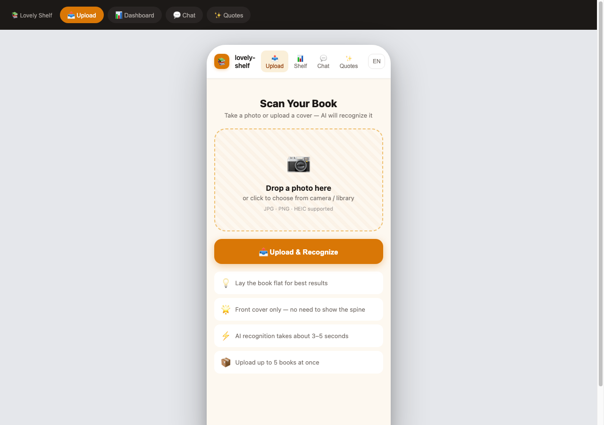
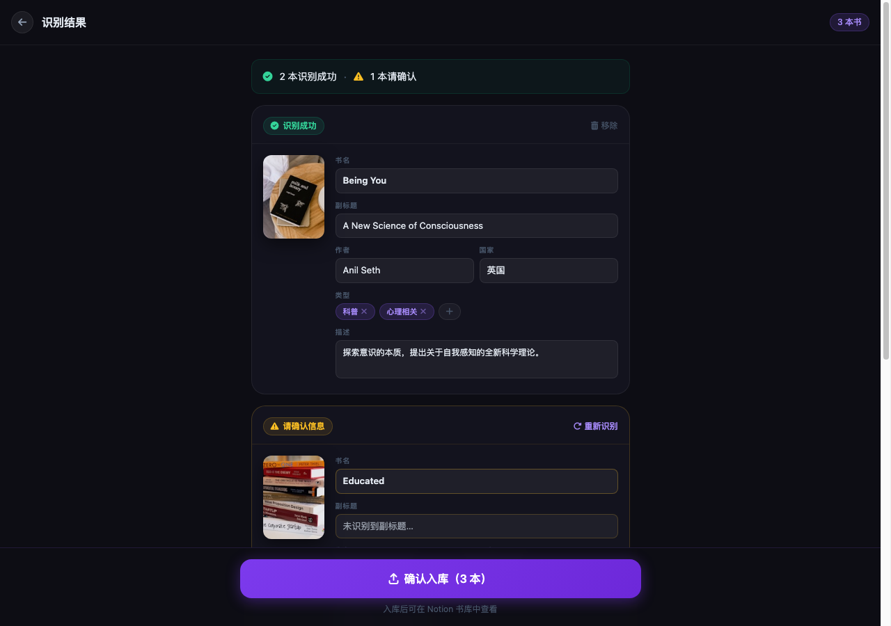
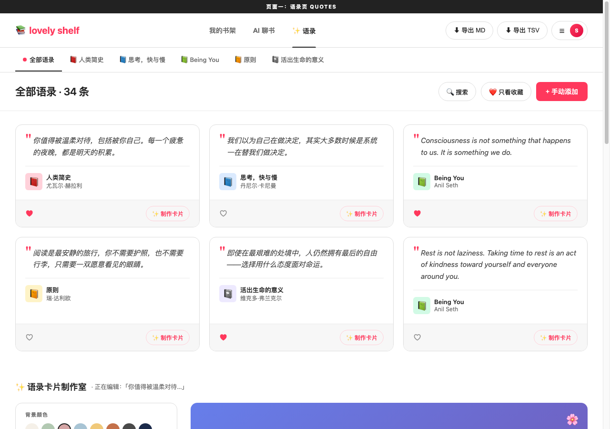
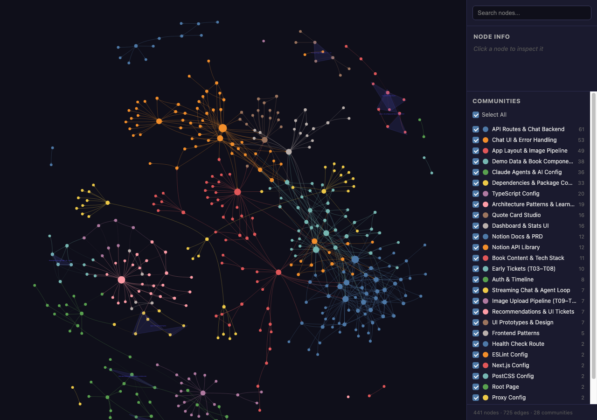
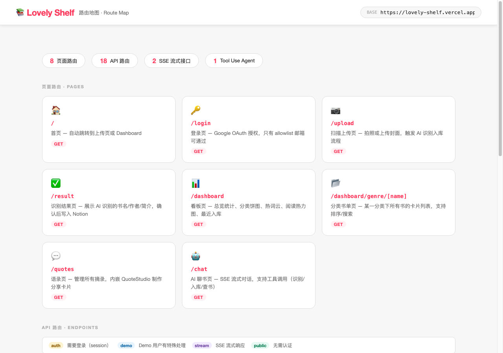

# I vibe-coded a full-stack AI app in 7 days as a beginner

> Point your camera at a book cover. Watch it land in Notion.

That's the whole pitch for lovely-shelf, a web app I built from scratch in a week. Take a photo of any book cover, and Claude AI reads it, extracts the title, author, genre, country, and memorable quotes, then writes everything into your Notion database automatically. No typing. No copy-paste. Just a photo.

I want to cover two things: what I built, and how I built it. The how is the interesting part. I'm a beginner developer learning Next.js. I vibe-coded this entire thing with Claude Code as my pair programmer, and it changed how I think about building software.

---

## What lovely-shelf does

**[Try the live demo](https://lovely-shelf.vercel.app)** (click the demo button, no account needed).



Five sections:

- Upload: drag a book cover photo, Claude reads it in seconds
- Dashboard: genre pie chart, 30-day activity heatmap, full book grid
- Quotes: every quote Claude extracted, searchable and filterable
- Quote Studio: turn any quote into a shareable card (PNG export or MP4 with background music)
- Chat: a streaming AI assistant that knows your entire shelf

```
┌─────────────────────────────────────────────────────┐
│                    Upload flow                       │
│                                                     │
│  Photo ──► Preprocess ──► Claude AI ──► Notion      │
│  (any size)  (sharp)       (vision)     (write)     │
│                                                     │
│  Step 1: Resize to ≤1200px, convert to JPEG         │
│  Step 2: Claude returns { title, author, genres,    │
│           country, quotes, description }             │
│  Step 3: Duplicate check -- link existing or create │
│  Step 4: Achievement badge + recommendation row     │
└─────────────────────────────────────────────────────┘
```

After recognition, the result page shows what Claude extracted and lets you confirm before writing to Notion:



---

## Tech stack

| Layer | Technology |
|-------|------------|
| Framework | Next.js (App Router) + TypeScript |
| Styling | Tailwind CSS v4 |
| Charts | Recharts |
| Image processing | sharp (server-side resize + JPEG conversion) |
| HEIC support | libheif-js (WebAssembly) then heic2any then Canvas API |
| AI | Anthropic Claude SDK |
| Database | Notion (via @notionhq/client) |
| Auth | next-auth v5 with Google OAuth |
| Real-time | Server-Sent Events (SSE) for streaming chat |
| Image search | Pixabay API |
| Music | Jamendo API |
| Deployment | Vercel |

Nothing exotic. Every library here is actively maintained and well-documented.

---

## Anthropic API vs OpenAI API -- why I chose one over the other

Both would have worked for this project. The core features (vision, structured output, streaming chat) exist on both platforms. Here's where they actually differ in practice:

| | Anthropic (Claude) | OpenAI (GPT-4o) |
|---|---|---|
| Vision API | `messages` with `image` content blocks | Same structure |
| Tool use / function calling | `tools` parameter, identical concept | `tools` / `functions` parameter |
| Streaming | `messages.stream()` with async iterator | `chat.completions.create({ stream: true })` |
| JSON output | Prompt-constrained, no native JSON mode at the time | `response_format: { type: "json_object" }` |
| Pricing (at time of build) | Sonnet cheaper than GPT-4o for comparable quality | GPT-4o-mini cheaper for simple tasks |
| Context window | 200k tokens | 128k tokens |

I chose Anthropic because I was already using Claude Code as my pair programmer, and it made sense to use the same model family in the app. The SDK is nearly identical structurally, so switching to OpenAI would be maybe two hours of work.

The one place where I hit friction: Anthropic's API doesn't have a native `json_mode` like OpenAI does. I had to extract JSON from the response with a regex (`{[\s\S]*}`) because Claude occasionally wraps the JSON in a sentence. OpenAI's `response_format` would have been cleaner there.

Other APIs in the project:

- **Notion API** (@notionhq/client): full read/write access to a Notion database. Creates pages, uploads cover images, queries for duplicates. The SDK is solid; the API itself is slow (3-5s per write operation).
- **Pixabay API**: image and video search for Quote Studio backgrounds. Free tier is generous.
- **Jamendo API**: royalty-free music search for Quote Studio MP4 recordings.
- **Google OAuth** (via next-auth): handles login. Only configured email addresses can sign in.

---

## How the AI works

The app uses Claude in three distinct ways.

### 1. Vision: reading a book cover

A photo comes in, gets resized by sharp, converted to base64, and sent to Claude's vision API:

```typescript
// src/lib/ai.ts
const response = await anthropic.messages.create({
  model: "claude-sonnet-4-6",
  max_tokens: 1024,
  messages: [{
    role: "user",
    content: [
      {
        type: "image",
        source: { type: "base64", media_type: "image/jpeg", data: base64Image }
      },
      {
        type: "text",
        text: `Look at this book cover and return JSON with:
          { title, subtitle, author, gender, country, genres[], description, quotes[] }
          Genres must be from: 小说 传记 回忆录 心理相关 历史 ...`
      }
    ]
  }]
})
```

Claude reads the cover and returns structured JSON. The prompt constrains the genre list to a fixed set so Notion tags stay consistent across the whole library.

### 2. Tool use: the agentic pipeline

There are two processing pipelines. The sequential one is straightforward: call Claude, call Notion, done. But there's also an agentic pipeline powered by Claude Tool Use.

```
User uploads cover
        |
Claude receives image + tools
        |
Claude decides: "I'll call recognize_book_from_image first"
        |
Tool executes, result returned to Claude
        |
Claude decides: "Now check_duplicate_in_notion"
        |
Tool executes, Claude sees result
        |
Claude decides: "No duplicate, I'll upload_cover_to_notion"
        |
        ... and so on
        |
Claude returns final summary
```

The app gives Claude four tools:

- `recognize_book_from_image`: run vision on the uploaded cover
- `check_duplicate_in_notion`: query the database by title and author
- `upload_cover_to_notion`: upload the image file to Notion
- `create_notion_page`: write the full book record

Claude orchestrates these itself. It decides the order, handles intermediate results, and can retry or skip steps based on what it finds. That's the real difference between a pipeline and an agent: the model is making decisions, not just transforming inputs.

To switch between modes: `NEXT_PUBLIC_USE_AGENT=true`.

### 3. Streaming chat: Claude knows your shelf

The chat feature streams responses via SSE. Claude has access to the same tools as the agentic pipeline, so it can look up books in your Notion database, recognize covers you send mid-conversation, or just discuss any book from its own knowledge.

```typescript
// src/app/api/chat/route.ts
const stream = await anthropic.messages.stream({
  model: "claude-sonnet-4-6",
  messages: conversationHistory,
  tools: bookTools,
})

for await (const chunk of stream) {
  if (chunk.type === "content_block_delta") {
    controller.enqueue(`data: ${chunk.delta.text}\n\n`)
  }
}
```

The chat reads the browser's language header and responds in Chinese or English.

The Quotes page shows every sentence Claude pulled from each book, filterable by book or category:



---

## The Claude Code skills I used (and what they actually do)

This is something I haven't seen written about much. Claude Code has a plugin/skill system that goes well beyond the base editor. I used several of these during the project, and they genuinely changed how I worked.

**Superpowers** is the biggest one. It's a methodology plugin that changes Claude's default behavior from "write code immediately" to "ask questions first." When you start a new task, Superpowers prompts Claude to clarify requirements, confirm the design, and agree on an implementation plan before touching any files. It enforces TDD (test-driven development), YAGNI (don't build what you don't need yet), and DRY (don't repeat yourself). Install it globally:

```
/plugin install superpowers@claude-plugins-official
```

The specific sub-skills I used from Superpowers:
- `brainstorming`: explores intent and requirements before implementation
- `writing-plans`: generates a step-by-step plan before any code
- `systematic-debugging`: structured approach to any bug or unexpected behavior
- `verification-before-completion`: runs checks before claiming something is done

**graphify** maps the entire codebase as a knowledge graph. After running `/graphify .`, it generated a 441-node interactive graph of every file, function, and relationship in the project. You can then run `/graphify query "how does the agentic pipeline work"` and it answers from the graph rather than from a linear file read.



**frontend-design** (Anthropic official skill) solves a specific problem: AI-generated UIs tend to look identical because the model defaults to the same visual choices every time (Inter font, purple gradient, card-based layout). This skill asks you aesthetic questions before writing any UI code. Minimal or expressive? Monochrome or colorful? Dense or spacious? Your answers constrain what it generates.

**awesome-design-md / DESIGN.md** is a separate approach to the same problem. Instead of asking questions each time, you pick a brand's design system (Airbnb, Linear, Notion, Vercel...) and put their DESIGN.md in your project root. Claude references it automatically when writing components. I used Airbnb's. You can see the result in the warm orange color palette and the rounded card layouts.

**vercel-labs/agent-skills** is Vercel's official set of Next.js-specific rules. Install it per-project:

```bash
npx skills add vercel-labs/agent-skills
```

It includes seven skills covering React best practices, accessibility, component composition patterns, and Vercel deployment optimization. Claude consults these automatically when writing components, without you needing to specify the rules each time.

How these three design tools divide the work:

| Tool | Answers | When |
|------|---------|------|
| DESIGN.md | What should it look like (colors, fonts, spacing) | Whole project, always |
| frontend-design skill | How to make design decisions in this style | Starting a new component |
| vercel-labs/agent-skills | Is the code written correctly | During implementation |

The route map below shows the full API surface the app exposes -- 8 page routes, 18 API endpoints, 2 SSE streaming routes, 1 Tool Use agent:



---

## HEIC: the iPhone format most apps just give up on

iPhone photos are HEIC. Most web apps reject them outright. lovely-shelf handles them with a three-tier fallback:

```
Try libheif-js (WebAssembly, most accurate)
  fails? Try heic2any (JS library, good compatibility)
  fails? Fall back to Canvas API (basic but universal)
```

This took a full afternoon. WebAssembly loads asynchronously, the library had no TypeScript types in DefinitelyTyped, and each tier produces slightly different output. Mobile-first means dealing with the formats that mobile actually creates.

---

## Demo mode: ship without exposing your database

You don't want strangers writing to your real Notion database, but you also want them to experience the full product. The solution is a special email address (`demo@lovely-shelf.com`). When next-auth sees it:

- Claude AI runs normally (real recognition, real results)
- All Notion operations are skipped
- The app reads from a hardcoded dataset of about 32 books
- The session resets on refresh

```typescript
// Every API route checks this before touching Notion
if (session.user.email === "demo@lovely-shelf.com") {
  return Response.json(getDemoData())
}
```

Visitors get a real AI experience. Your Notion database stays untouched. One condition, applied at every route.

---

## How I actually built this

I'm a beginner. I didn't know Next.js App Router before this project. I built the whole thing in 7 days with Claude Code as my pair programmer.

Day 1 (May 13): Set up Next.js, installed dependencies, wrote the image preprocessing function, connected Claude Vision, wrote Notion helpers, wired up the `/api/process` endpoint.

Day 2: Upload page, results page, mobile layout, batch uploads, HEIC support, duplicate detection.

Day 3: Google OAuth, achievement badges, recommendations, Dashboard, book detail modal with editable fields that write back to Notion.

Day 4 (the big one): Rewrote the backend as a Tool Use agent, built the chat interface with SSE streaming, Quote Studio with font/background/music controls, Dashboard heatmap, demo mode.

Days 5-7: Bug fixes, rate limiting, error boundaries, i18n (full Chinese/English), deploy.

The way I used Claude Code wasn't "write this file for me." It was more like: here's what I'm trying to do, here's the code I have, what's wrong and why. Claude would explain the concept, show me the pattern, and then I'd implement it while understanding what I was actually typing.

Every code block in this project has Chinese comments next to the key logic. Not for future readers. Writing them forced me to understand what I'd just built.

---

## Agents vs. sequential API calls

The difference between calling an AI API and building an AI agent is not as large as people make it sound. But it's real.

The sequential pipeline is predictable, fast, and easy to debug:

```
Input -> Claude -> Notion -> Output
```

The agentic pipeline is more flexible. If the cover is blurry, Claude might give a lower-confidence guess and say so. If the book already exists, it stops early and explains why. The model is making calls, not executing a fixed script.

The tradeoff: agents are harder to test. You can't unit-test a decision. You run the agent, read what it decided, and judge whether it was right.

---

## Notion as a database

Using Notion as a backend database is underrated. The API is clean, the SDK is well-maintained, and you get a human-readable, editable view of your data for free.

| Field | Type | Purpose |
|-------|------|---------|
| 书名 | Title | Book title |
| 作者 | Rich text | Author |
| 国家 | Select | Country |
| 类型 Label | Multi-select | Genres |
| 封面 | Files & media | Cover image |
| 优美语句 | Rich text | Extracted quotes |
| 描述 | Rich text | Summary |

The multi-select genre field auto-creates new tags as Claude encounters new genres. The cover uploads directly to Notion's file storage. After that, the whole record is sortable, filterable, and editable in Notion's own interface.

One thing to know: Notion's API is slow. A full write (image upload plus page create) takes 3-5 seconds. Not a bug, just how it is.

---

## What I'd do differently

TypeScript types for external APIs aren't guaranteed. libheif-js had none, so I wrote a `.d.ts` declaration file manually. Normal situation; just handle it.

For one-directional streaming, SSE is the right tool. WebSockets are for bidirectional real-time communication (multiplayer games, collaborative editors). I see a lot of beginners reach for WebSockets when SSE does the job with half the code.

I added demo mode on day five, which meant touching every API route. Next time I'd design the data layer from the start so demo data and real data implement the same interface.

I shared the app with three friends before adding rate limiting. Hit my Anthropic API limit the next day. Add it before you share.

Install the Claude Code skills at the start of the project, not partway through. Superpowers especially -- its value is in shaping how you approach the work before you've written anything. I got it working near the end and thought "I wish I'd had this on day one."

---

## Try it

Live demo: [lovely-shelf.vercel.app](https://lovely-shelf.vercel.app)

Stack: Next.js, TypeScript, Claude Sonnet 4.6, Notion API, next-auth, Tailwind CSS, Vercel.

If you want to see what a small AI project actually looks like (not a tutorial, a real app), this is a reasonable example. It's not impressive by production standards, but it's honest.

---

*Built in 7 days, May 2025.*
